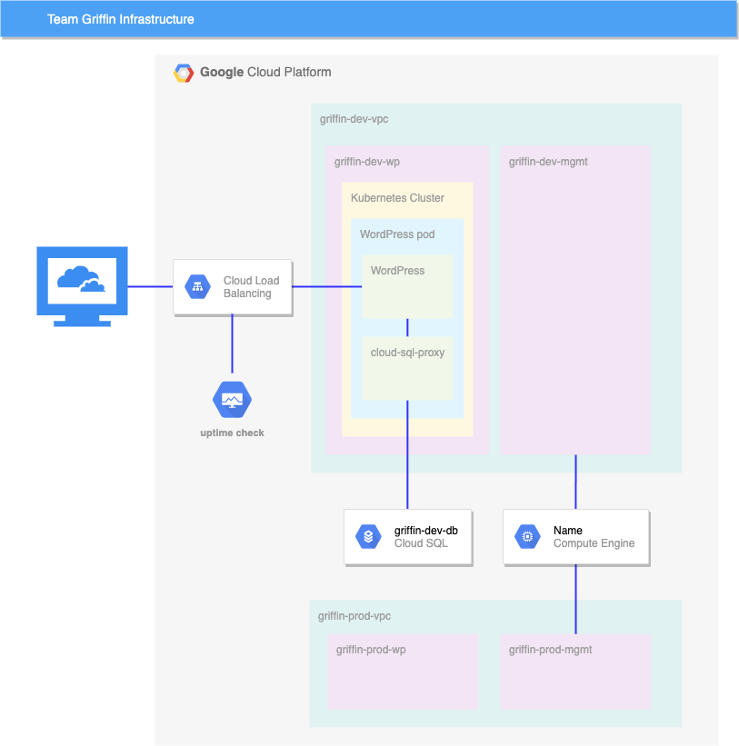
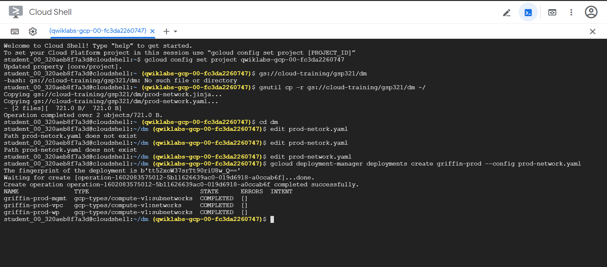
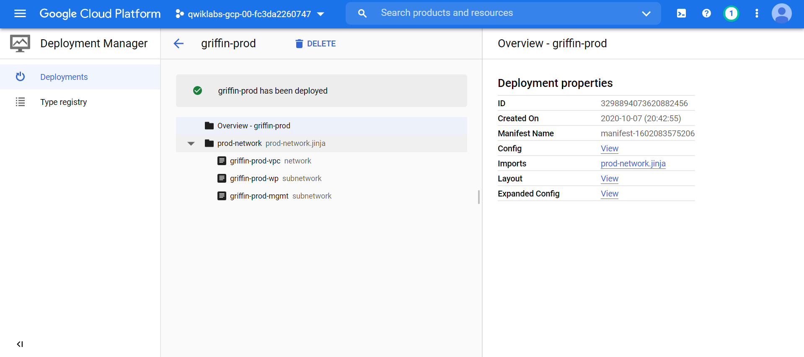

# Set up and Configure a Cloud Environment in Google Cloud: Challenge Lab

> ## **_GSP321_**

## **Topics tested:**

* Creating and using VPCs and subnets
* Configuring and launching a Deployment Manager configuration
* Creating a Kubernetes cluster
* Configuring and launching a Kubernetes deployment and service
* Setting up stackdriver monitoring
* Configuring an IAM role for an account

## **Challenge scenario**

As a cloud engineer in Jooli Inc. and recently trained with Google Cloud and Kubernetes you have been asked to help a new team (Griffin) set up their environment. The team has asked for your help and has done some work, but needs you to complete the work.

You are expected to have the skills and knowledge for these tasks so don’t expect step-by-step guides.

You need to complete the following tasks:

* Create a development VPC with three subnets manually
* Create a production VPC with three subnets using a provided Deployment Manager configuration
* Create a bastion that is connected to both VPCs
* Create a development Cloud SQL Instance and connect and prepare the WordPress environment
* Create a Kubernetes cluster in the development VPC for WordPress
* Prepare the Kubernetes cluster for the WordPress environment
* Create a WordPress deployment using the supplied configuration
* Enable monitoring of the cluster via stackdriver
Provide access for an additional engineer

Some Jooli Inc. standards you should follow:

* Create all resources in the `us-east1` region and `us-east1-b` zone, unless otherwise directed.

* Use the project VPCs.

* Naming is normally team-resource, e.g. an instance could be named **kraken-webserver1**.

* Allocate cost effective resource sizes. Projects are monitored and excessive resource use will result in the containing project's termination (and possibly yours), so beware. This is the guidance the monitoring team is willing to share: unless directed, use `n1-standard-1`.

## **Your challenge**

You need to help the team with some of their initial work on a new project. They plan to use WordPress and need you to set up a development environment. Some of the work was already done for you, but other parts require your expert skills.

As soon as you sit down at your desk and open your new laptop you receive the following request to complete these tasks. Good luck!

### Environment



## **Task 1: Create development VPC manually**

Create a VPC called `griffin-dev-vpc` with the following subnets only:

* `griffin-dev-wp`
  * IP address block: `192.168.16.0/20`
* `griffin-dev-mgmt`
  * IP address block: `192.168.32.0/20`
  
Click _Check my progress_ to verify the objective.

> **SOLUTION**

Make sure you create all resources in the us-east1 region and us-east1-b zone.

1. In the Google Cloud Console, navigate to **VPC network > VPC networks**
2. Click on **Create VPC network**.
3. Enter `griffin-dev-vpc` to the **Name** field.
4. Select **Custom** for the Subnet creation mode.
5. Add `griffin-dev-wp` subnet with the following parameters:

**Field**  | **Value**
-|-
Name: | `griffin-dev-wp`
Region:  |  `us-east1`
IP address range: |  `192.168.16.0/20`

6. Click **+ Add subnet** and add `griffin-dev-mgmt` subnet with the following parameters

**Field**  | **Value**
-|-
Name: | `griffin-dev-mgmt`
Region:  |  `us-east1`
IP address range: |  `192.168.16.0/20`

7. Click **CREATE**.

## **Task 2: Create production VPC using Deployment Manager**

Use Cloud Shell and copy all files from `gs://cloud-training/gsp321/dm.`

Check the Deployment Manager configuration and make any adjustments you need, then use the template to create the production VPC with the 2 subnets.

Click _Check my progress_ to verify the objective.

> **SOLUTION**

1. Copy the Deployment Manager configuration files to Cloud Shell using the following command:

```terminal
gsutil cp -r gs://cloud-training/gsp321/dm ~/
```

2. Edit `prod-netork.yaml` configuration file

```terminal
cd dm
edit prod-network.yaml
```

3. Replace `SET_REGION` to `us-east1` in the editor, and then save the change.

4. Go back to the Cloud Shell, use the following command to create the production VPC network with the configuration files:

```terminal
gcloud deployment-manager deployments create griffin-prod --config prod-network.yaml
```



5. Go back to the Cloud Console, navigate to **Deployment Manager** to confirm the deployment.



## **Task 3: Create bastion host**

Create a bastion host with two network interfaces, one connected to `griffin-dev-mgmt` and the other connected to `griffin-prod-mgmt`. Make sure you can SSH to the host.

Click _Check my progress_ to verify the objective.

> **SOLUTION**

1. In the Cloud Console, navigate to **Compute Engine > VM instances**.

2. Click **CREATE**.

3. Use the following parameters to create the bastion host:

**Field**  | **Value**
-|-
Name: | `griffin-dev-db`
Region:  |  `us-east1`

4. Expand the **Management, security, disks, networking, sole tenancy** section.

5. In the **Networking** tab, add `bastion` to the Network tags.

6. Click **Add network interface**, make sure that you set up two Network interfaces,

    * `griffin-dev-mgmt`
    * `griffin-prod-mgmt`

7. Click **CREATE**.

8. Navigate to **VPC network > Firewall**

9. Click **CREATE FIREWALL RULE**.

10. Configure the rule with the following parameters:

**Field**  | **Value**
-|-
Name: | `allow-bastion-dev-ssh`
Network: | `griffin-dev-vpc`
Targets: | `bastion`
Source IP ranges: | `192.168.32.0/20`
Protocols and ports: | tcp: `22`

11. Click **CREATE**.

12. Click **CREATE FIREWALL RULE** again.

13. Configure another rule with the following parameters:

**Field**  | **Value**
-|-
Name: | `allow-bastion-prod-ssh`
Network: | `griffin-prod-vpc`
Targets: | `bastion`
Source IP ranges: | `192.168.48.0/20`
Protocols and ports: | tcp: `22`

14. Click **CREATE**.

